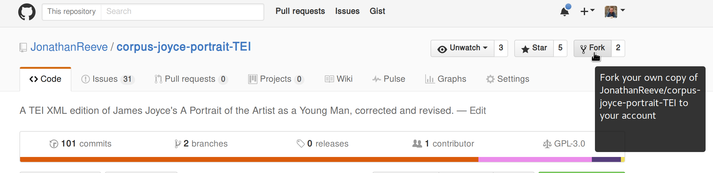
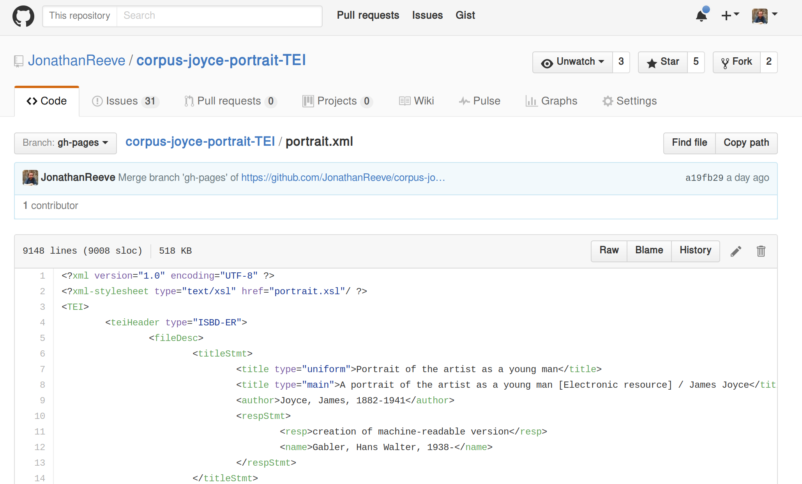
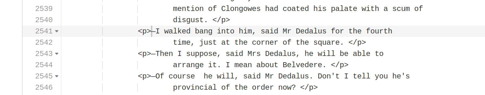
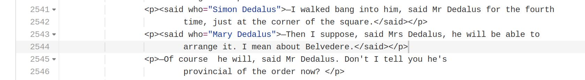
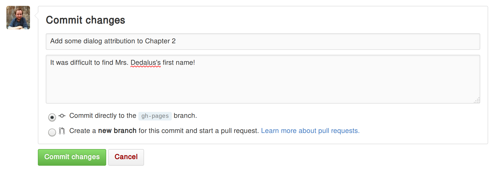
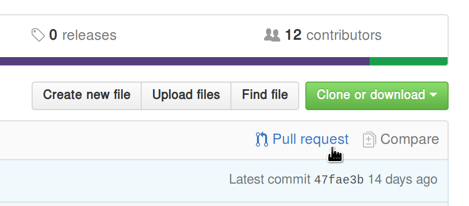
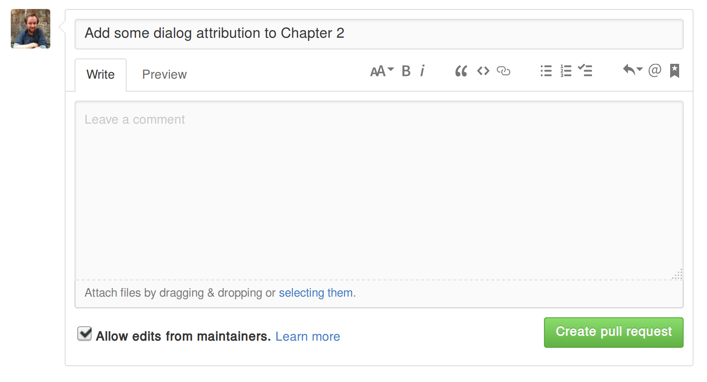

# How to Contribute
This is a guide for contributing to the open critical edition of James Joyce’s _A Portrait of the Artist as a Young Man_. It assumes no prior technical experience. It was initially written for students in the course “James Joyce,” taught at Columbia University in Fall 2016, but other contributors can use it, as well.

## Step 1: Sign up for a GitHub account.
GitHub accounts are free, and you can sign up for one at [github.com](https://github.com/). Try to make sure your real name and main email address are shown somewhere in your user profile, so that your work can be properly credited to you. 

## Step 2: Choose something to contribute. 
There are already lots of plans for new features and things in [the project issue tracker](https://github.com/JonathanReeve/corpus-joyce-portrait-TEI/issues), so you could choose one of those issues to work on. The easiest issues are [the ones with the markup flag](https://github.com/JonathanReeve/corpus-joyce-portrait-TEI/issues?q=is:open+is:issue+label:markup). You can also try answering one of [the open questions in the tracker](https://github.com/JonathanReeve/corpus-joyce-portrait-TEI/issues?utf8=✓&q=is:open%20is:issue%20label:question). 

Once you choose something to work on, make sure to leave a note in that issue so that others won’t be working on the same thing. For example, let’s say you want to work on marking up dialog for part of Chapter 2. First, see if an issue exists for that by looking through the list of issues. It does--it’s [issue #7: add dialog attribution with format <said who="">](https://github.com/JonathanReeve/corpus-joyce-portrait-TEI/issues/7). Next, look through the comments for that issue to make sure no one else is already working on that section. Then, log in to GitHub, and leave a comment at the bottom of that issue, saying something like “I’ll start working on dialog attribution for part of Chapter 2.”

## Step 3: Fork the project. 
“Forking” is just coding jargon for making a copy of a project. To fork the project, go to [the project homepage](https://github.com/JonathanReeve/corpus-joyce-portrait-TEI), and click the “Fork” button in the upper right corner: 

This will create a copy of the project in your user account where you will make all of your changes. Now your copy lives at `github.com/your-username-here/corpus-joyce-portrait-TEI`. Navigate to your fork’s homepage, if you’re not already there. You can also find it by going to your profile page and clicking the “repositories” tab. 

## Step 4: Make your edits. 
Portrait.xml is the name of the main TEI XML file for the novel. To browse through it, you can find it [here on the project site](https://github.com/JonathanReeve/corpus-joyce-portrait-TEI/blob/gh-pages/portrait.xml), but to edit it, you’ll have to find this file on your fork. To do that, go to your fork, click the “Code” tab, and click “portrait.xml” in the file listing. You can also navigate to the URL `https://github.com/your-username-here/corpus-joyce-portrait-TEI/blob/gh-pages/portrait.xml`, replacing `your-username-here` with your GitHub username. Now you should see something like this: 

but instead of my username, JonathanReeve, you should see your own. To edit the file, click the pencil icon in the upper right: 

Now you should be able to make changes to your fork. Find the area in the novel that you want to change (you can click in the text area and use Control+F to search the novel for your section), and then make the changes. For example, here is what my dialog section looked like before: 

And here is what it looks like after I make my edit: 

If you’re not already used to XML, there are a couple things to note here. 

 * The `<said>` tags are inside the `
` tags, since the dialog is within the paragraph, not the other way around. 
 * For the attribution (`who=`), I’m writing the full name of the character, not just how they’re referred to in this line of text (i.e. “Simon Dedalus” instead of “Mr. Dedalus”). 
  
If you want a quick introduction to XML, check out [the w3schools introduction](http://www.w3schools.com/xml/xml_whatis.asp), a 10-minute read at most. If you want a more TEI-specific guide, the [TEI Lite Introduction](http://www.tei-c.org/release/doc/tei-p5-exemplars/html/tei_lite.doc.html) is good. 

## Step 5: Commit your changes. 
Now that you’ve made all your changes for this round (you might want to make another, separate set of changes later), you can commit your changes, and describe what it is that you did. **Please reference the issue that you're working on.** For this dialog attribution example, I’ve described my change as `Add dialog attribution to Chapter 2, for issue #7`, and added an additional description that `It was difficult to find Mrs. Dedalus’s first name!`. 

Repeat steps 4-5 as necessary, until you’re done making your changes. 

## Step 6: Submit a pull request with your changes. 
Now that you’ve made your changes, you’ll want to submit them to the main edition for approval. A “pull request” is a request to the main project to integrate the changes you made on your fork. To submit a pull request, go to your fork’s homepage, i.e. `github.com/your-username-here/corpus-joyce-portrait-tei` and click the button labeled “Pull request”: 

This should bring up a page where you can describe your pull request: 

 

Write a description of all the edits you committed. In this example, I wrote roughly the same thing as my commit message, `Add dialog attribution to Chapter 2, for issue #7`, but if you have more than one commit, you’ll want to describe the changes represented by all of your commits.

Before clicking “Create pull request,” scroll down and review your changes once more. If everything looks good, create the pull request. 

# What Tags To Use 

* Attribute dialog by surrounding it with `<said who="">` and `</said>`
* Mark up poetry (and verse more generally) by surrounding stanzas with `<lg>` (for “line group”) and lines with `<l>` (for “line”). End each stanza with `</lg>` and each line with `</l>` 
* Mark up personal names with `<persName>` and place names with `<placeName>`. 
* Mark up songs with `<seg type="song">` and prayers with `<seg type="prayer">`
* Mark up foreign languages with, e.g. `<seg xml:lang="fra">`, using the standard 3-letter language codes (ISO-639)

If the feature you’d like to mark up is not in the above list, first see if there’s an issue in [the issue tracker](https://github.com/JonathanReeve/corpus-joyce-portrait-TEI/issuesc) for it. If there’s no issue, or if there’s no tag convention in the issue’s comments, consult [the TEI P5 Guidelines](http://www.tei-c.org/release/doc/tei-p5-doc/en/html/). When in doubt, feel free to ask a question [in our Gitter chatroom](https://gitter.im/corpus-joyce-portrait-TEI/Lobby#). 
